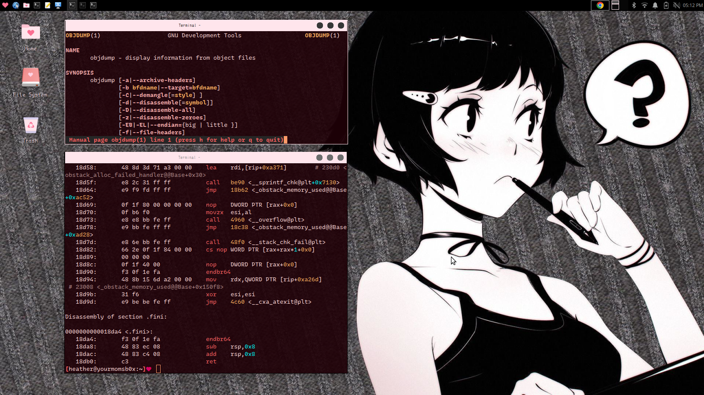

# Heather's Eye Candy

**Heather's Eye Candy** is a handcrafted set of beautiful, robust themes for women in technology.. Each theme is
lovingly packaged with matching icons, themes, and modular themed dotfile packages.

---

## Download the latest version on the [Releases Page](https://github.com/heathershaw821/Heathers-eye-candy/releases)

---

### CyberPink <3

## What's in the box?

- `themes`: Beautiful window manager themes
  - GTK2/3/3.2
  - unity
  - xfwm4
  - metacity
  - openbox
  - cinnamin

- `icons`: Gorgeous handmade icon sets
- `packages`: Modular config bundles
  - Bashrc
  - neofetch
  - xfce4-terminal
  - *And More!!!*
- `fonts`: A curated collection of amazing Nerd Fonts
- `wallpapers`: My current favorite wallpapers, often I like to tweak these a bit for taste

Download the latest release [here](https://github.com/heathershaw821/Heathers-eye-candy/releases)!!!!
